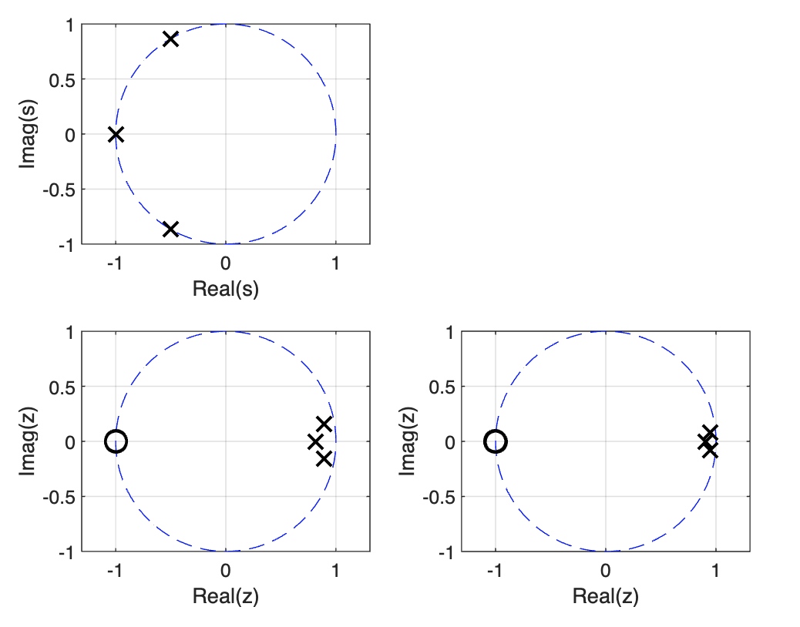
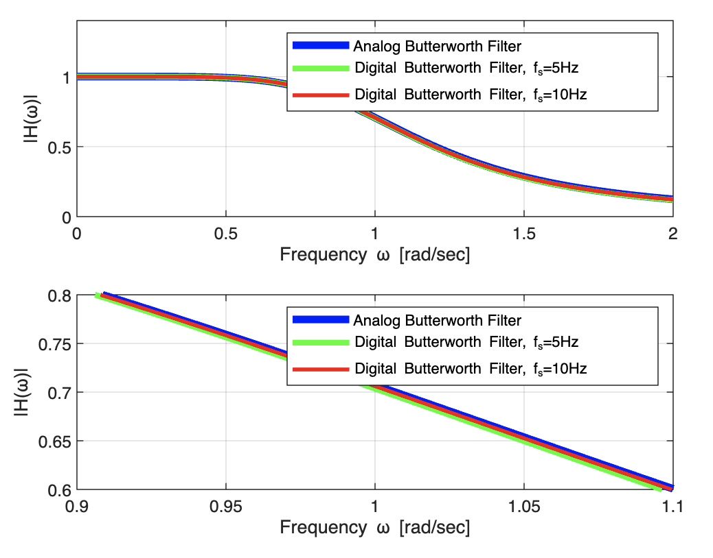
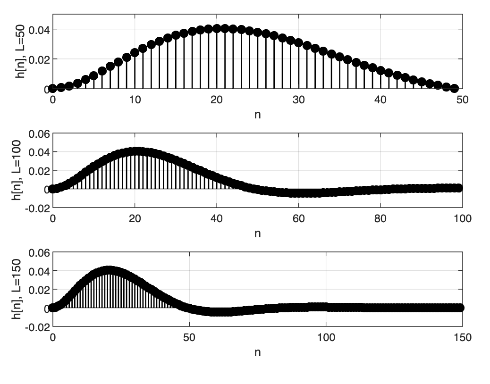
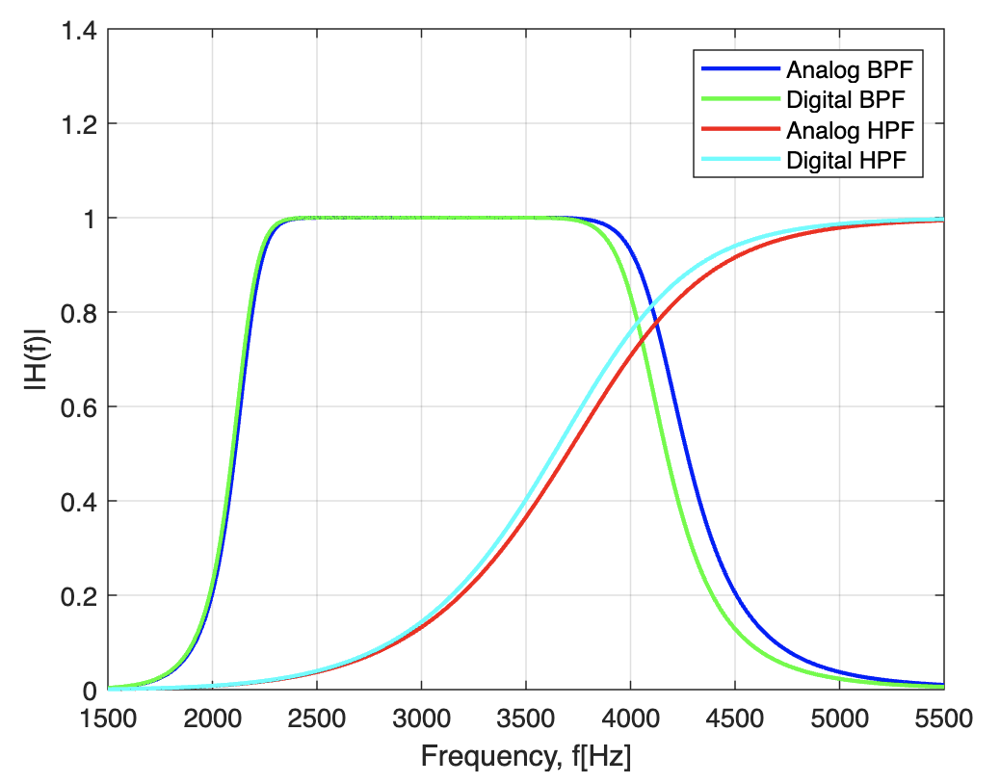

### IIR 필터

#### 실습 1번

```matlab
clc
clear

theta = linspace(0,2*pi); %주파수 영역 범위
x = cos(theta);  %단위원을 위한 x
y = sin(theta);

Hs_n = 1; %butterworth LPF의 분자요소
Hs_d = [1 2 2 1]; %butterworth LPF의 분모 요소
fs_1 = 5; %sampling time 5hz
fs_2 = 10; %sampling time 10 hz
w = linspace(0,2,1000); %
W = linspace(0,2*pi,1000); %주파수 응답을 확인하기 위한 범위

[Hz_n_f1,Hz_d_f1] = bilinear(Hs_n,Hs_d,fs_1); %bilinear(num, den, fs)
[Hz_n_f2,Hz_d_f2] = bilinear(Hs_n,Hs_d,fs_2); %아날로그 시스템의 전달함수를 이산화 함
%5, 10hz로 각각 이산화 함

Hz_f1 = tf(Hz_n_f1,Hz_d_f1) %이산화된 전달함수
Hz_f2 = tf(Hz_n_f2,Hz_d_f2) %이산화된 전달함수

[z_s,p_s,k1] = tf2zp(Hs_n,Hs_d); %전달함수로부터 pole, zero 구하기
[z_f1,p_f1,k2] = tf2zp(Hz_n_f1,Hz_d_f1); %전달함수로부터 pole, zero 구하기
[z_f2,p_f2,k3] = tf2zp(Hz_n_f2,Hz_d_f2); %전달함수로부터 pole, zero 구하기
%디지털 전달함수로부터 주파수 응답을 구함
Hs_w = freqs(Hs_n,Hs_d,w); %아날로그 butterworth 필터의 주파수 응답
Hz_W_f1 = freqz(Hz_n_f1,Hz_d_f1,W/fs_1); %5hz 이산화 된 디지털 필터의 주파수 응답
Hz_W_f2 = freqz(Hz_n_f2,Hz_d_f2,W/fs_2); %10hz 이산화 된 디지털 필터의 주파수 응답

figure(1)
subplot(2,2,1)
plot(x,y,'b--')
hold on;
grid on;
plot(z_s,'ko','MarkerSize',10,'LineWidth',1.3)
plot(p_s,'kx','MarkerSize',10,'LineWidth',1.3)
ylim([-1,1])
xlabel("Real(s)")
ylabel("Imag(s)")
axis equal

subplot(2,2,3)
plot(x,y,'b--')
hold on;
grid on;
plot(z_f1,'ko','MarkerSize',10,'LineWidth',1.3)
plot(p_f1,'kx','MarkerSize',10,'LineWidth',1.3)
ylim([-1,1])
xlabel("Real(z)")
ylabel("Imag(z)")
axis equal

subplot(2,2,4)
plot(x,y,'b--')
hold on;
grid on;
plot(z_f2,'ko','MarkerSize',10,'LineWidth',1.3)
plot(p_f2,'kx','MarkerSize',10,'LineWidth',1.3)
ylim([-1,1])
xlabel("Real(z)")
ylabel("Imag(z)")
axis equal

figure(2)
subplot(2,1,1)
plot(w,abs(Hs_w),'b','LineWidth',4)
hold on
grid on
plot(W,abs(Hz_W_f1),'g','LineWidth',3)
plot(W,abs(Hz_W_f2),'r','LineWidth',2)
xlim([0,2])
ylim([0,1.4])
xlabel("Frequency \omega [rad/sec]")
ylabel("|H({\omega})|")
legend("Analog Butterworth Filter","Digital Butterworth Filter, f_s=5Hz","Digital Butterworth Filter, f_s=10Hz")

subplot(2,1,2)
plot(w,abs(Hs_w),'b','LineWidth',4)
hold on
grid on
plot(W,abs(Hz_W_f1),'g','LineWidth',3)
plot(W,abs(Hz_W_f2),'r','LineWidth',2)
xlim([0.9,1.1])
ylim([0.6,0.8])
xlabel("Frequency \omega [rad/sec]")
ylabel("|H({\omega})|")
legend("Analog Butterworth Filter","Digital Butterworth Filter, f_s=5Hz","Digital Butterworth Filter, f_s=10Hz")

figure(3)
subplot(3,1,1)
L = 50;
n = linspace(0,L-1,L);
x_f2 = dirac(n);
x_f2_infindex = (x_f2 == Inf);
x_f2(x_f2_infindex) = 1;
hn_f = filter(Hz_n_f2,Hz_d_f2,x_f2);
stem(n,hn_f,'k','LineWidth',1,'MarkerFace','k')
ylim([0,0.05])
xlabel("n")
ylabel("h[n], L=50")
grid on;

subplot(3,1,2)
L = 100;
n = linspace(0,L-1,L);
x_f2 = dirac(n);
x_f2_infindex = (x_f2 == Inf);
x_f2(x_f2_infindex) = 1;
hn_f = filter(Hz_n_f2,Hz_d_f2,x_f2);
stem(n,hn_f,'k','LineWidth',1,'MarkerFace','k')
ylim([-0.02,0.06])
xlabel("n")
ylabel("h[n], L=100")
grid on

subplot(3,1,3)
L = 150;
n = linspace(0,L-1,L);
x_f2 = dirac(n);
x_f2_infindex = (x_f2 == Inf);
x_f2(x_f2_infindex) = 1;
hn_f = filter(Hz_n_f2,Hz_d_f2,x_f2);
stem(n,hn_f,'k','LineWidth',1,'MarkerFace','k')
ylim([-0.02,0.06])
xlabel("n")
ylabel("h[n], L=150")
grid on


%figure 1 결과
% 아날로그 필터 및, 이산화된 디지털 필터의 pole, zero
% 아날로그 필터의 안정성은 제한적으로 디지털 필터의 안정성과 일치한다.
% 세 필터 모두 안정됨.(단위원 내 극점 존재)

%figure 2 결과
% 아날로그 필터 및 디지털 필터(5, 10hz sampling)의 주파수 응답 비교
% bilinear trasformation는 s와 z도메인의 관계에서 나오는 초월함수(log)를 유리식으로 
% 근사화를 한 것이기 때문에 주파수 응답에 약간의 오차가 발생.

%figure3 결과
%Hz_f1 = tf(Hz_n_f1,Hz_d_f1)
%Hz_f2 = tf(Hz_n_f2,Hz_d_f2)
%위 두 전달함수의 분모를 보면, 과거 출력에 대한 term이 있기 때문에
% IIR 필터
```



- 아날로그 필터 및 이산화된 디지털 필터의 pole, zero 그림이다.
    - 아날로그 필터의 안정성은, 이산화 과정에서의 샘플링 frequecy에 의존적이며
    - 대체로 아날로그 필터의 안정성을 따라감
    - 상기 사진에서는 세 필터 모두 안정한 필터라고 할 수 있음


- s도메인에서의 주파수 응답 및 이산화된 디지털 시스템(z 도메인)에서의 주파수 응답 비교
- 두 디지털 시스템은 5, 10hz로 샘플링 됨
- bilinear trasformation은 s도메인과 z도메인간의 관계식에서 나오는 초월함수인 `log`를 유리화(전달함수의 분모를 유리화 해야해서)
- 유리수로 근사하는 변환이기 때문에, 오차가 발생하며, 이 오차는 sampling frequecy에 종속적이다.


- 두 전달함수의 분모를 보면, 과거출력에 대한 term이 있기 때문에 IIR 필터임.

```console
Hz_f1 =
 
  0.000819 s^3 + 0.002457 s^2 + 0.002457 s + 0.000819
  ---------------------------------------------------
          s^3 - 2.602 s^2 + 2.279 s - 0.6708
 
Continuous-time transfer function.


Hz_f2 =
 
  0.0001131 s^3 + 0.0003393 s^2 + 0.0003393 s + 0.0001131
  -------------------------------------------------------
              s^3 - 2.8 s^2 + 2.62 s - 0.8188
 
Continuous-time transfer function.
```

- 위는 두 z도메인에서의 전달함수를 분모,분자 계수를 이용해 만들었음.
- 분모에 s^3 에 대한 요소만 있는것이 아닌 그 이하 차수에 대해서도 있으므로, 과거 출력이 있는 것
- 따라서 IIR(Infinte Impulse Response) 필터임

#### 실습 2번

```matlab
clc
clear

N = 7; %7차 butterworth 필터의 차수 정의
fs = 50000; % 표본화주파수 50,000hz
f = linspace(0,5500,110000); %주파수 범위 정의
f_o = f*2*pi;
[LF_z,LF_p,LF_k] = buttap(N); %7차 butterworth필터 정의
[LF_n,LF_d] = zp2tf(LF_z,LF_p,LF_k); %zero, pole로부터 전달함수 변환

%low pass filter로부터 bandpass filter로 전환 
[BPF_A_n,BPF_A_d] = lp2bp(LF_n,LF_d,3000*2*pi,2000*2*pi); 
%low pass filter로부터 high pass filter로 전환 
[HPF_A_n,HPF_A_d] = lp2hp(LF_n,LF_d,4000*2*pi);

%위에서 구한 BPF, HPF를 이산화,
[BPF_D_n,BPF_D_d] = bilinear(BPF_A_n,BPF_A_d,fs);
[HPF_D_n,HPF_D_d] = bilinear(HPF_A_n,HPF_A_d,fs);

%s 도메인 (아날로그 필터, s도메인의 전달함수)에 대한 주파수 응답
BPF_A = freqs(BPF_A_n,BPF_A_d,f*2*pi);
HPF_A = freqs(HPF_A_n,HPF_A_d,f*2*pi);

%z 도메인 (이산화된 디지털 시스템의 전달함수를 이용한 주파수 응답)
BPF_D = freqz(BPF_D_n,BPF_D_d,f_o/fs);
HPF_D = freqz(HPF_D_n,HPF_D_d,f_o/fs);

figure(4)
plot(f,abs(BPF_A),'b','LineWidth',1.5)
hold on
grid on
plot(f,abs(BPF_D),'g','LineWidth',1.5)
plot(f,abs(HPF_A),'r','LineWidth',1.5)
plot(f,abs(HPF_D),'c','LineWidth',1.5)
xlim([1500,5500]);
ylim([0,1.4]);
xlabel("Frequency, f[Hz]");
ylabel("|H(f)|");
legend("Analog BPF","Digital BPF","Analog HPF","Digital HPF");

%figure 4
% 각 BPF및 HPF의 주파수 응답 및 이산화된 디지털 시스템의 주파수 응답
% 아날로그 필터의 주파수 응답과 거의 일치한다.
% 표본화 주파수가 높아질수록 아날로그 필터의 응답과 오차가 줄어든다.
```


- BPF 및 HPF의 주파수 응답 및 이산화된 디지털 시스템의 주파수 응답
- 아날로그 필터의 응답과 거의 일치한다.
- 오차가 생기는 이유는 초월함수를 유리수로 근사화 하면서 발생하며, 샘플링 주기에 종속적임
- 샘플링 주파수가 높을수록 오차가 줄어든다.

#### 실습 3번

```matlab
clc
clear
N = 7; %7차 butterworth 필터
fc = 300; %컷오프 주파수 300hz
fs = 3000; %샘플링 주파수 3000hz
fd = linspace(0,600,1024); %freqeuncy domain
f1 = 100; % 각 신호의 발생주기 100hz
f2 = 500; %각 신호의 500hz
%n = 0,1,2,...500
n = linspace(0,499,500);
W = linspace(0,499,500);

xn = cos(2*pi*f1*(n/fs)) + cos(2*pi*f2*(n/fs));
% 입력 신호 생성 

[LF_z,LF_p,LF_k] = buttap(N); %7차 butterworth 필터 생성
[LF_n,LF_d] = zp2tf(LF_z,LF_p,LF_k); %buttap으로 생성된 pole, zero를 이용해 전달함수 생성
[LF_c_n,LF_c_d] = lp2lp(LF_n,LF_d,fc*2*pi);%lowpass filter의
%cut off 주파수를 변경 (300hz)

[LF_c_D_n,LF_c_D_d] = bilinear(LF_c_n,LF_c_d,fs);
% 3000hz 주기로 이산화 된 디지털 전달함수 생성

LF_c_D = freqz(LF_c_D_n,LF_c_D_d,fd*2*pi/fs);
%이산화된 필터의 주파수 응답

t = 0:1/fs:0.1;
xt = cos(2*pi*f1*t) + cos(2*pi*f2*t);
yt = filter(LF_c_D_n,LF_c_D_d,xt);
yn = filter(LF_c_D_n,LF_c_D_d,xn);

%크기 스펙트럼 계산
[f0,X] = myfun_SA(n/fs,xn);
[f0_1,Y] = myfun_SA(n/fs,yn);

figure(5)
subplot(3,2,1)
t = 0:1/fs:0.1;
xt = cos(2*pi*f1*t) + cos(2*pi*f2*t);
plot(t,xt,'k','LineWidth',1.8)
xlabel("t[sec]");
ylabel("x(t)");
grid on

subplot(3,2,2)
plot(f0,abs(X),'ok-','LineWidth',1.8,'MarkerFace','k')
xlim([0,600])
ylim([0,0.08])
grid on
xlabel("Frequency, f[Hz]");
ylabel("|X(f)|");

subplot(3,2,4)
plot(fd,abs(LF_c_D),'k','Linewidth',1.8)
xlabel("Frequency, f[Hz]");
ylabel("Frequency response,|X(f)|");
grid on

subplot(3,2,5)
plot(t,yt,'k','Linewidth',1.8)
xlabel("t[sec]");
ylabel("y(t)");
ylim([-1.5,1.5])
grid on

subplot(3,2,6)
plot(f0_1,abs(Y),'ok-','LineWidth',1.8,'MarkerFace','k')
xlim([0,600])
xlabel("Frequency, f[Hz]");
ylabel("|Y(f)|");
grid on

% figure 5
% 생성한 입력신호를 필터를 통과시킨다
% 300hz 컷오프 주파수가 정상적으로 동작하는지 확인해본다.
% 입력의 크기스펙트럼의 경우 100과 500hz 범위에서 튀는것을 확인
% 출력의 크기스펙트럼의 경우 cutoff 주파수인 500hz가 넘는 요소는 제거
% 따라서 출력의 크기스펙트럼에는 100hz의 요소가 보인다.
% 따라서 y(t) (time domain)에서 보더라도, 100hz의 요소만 남은것이 확인 된다.
```

- 생성한 입력신호 (100, 500hz 주파수의 cos 함수 합성)를 필터를 통과시켜본다
- 300hz 컷오프 주파수의 bpf 필터를 이산화해서 잘 동작하는지 테스트
- 입력 신호의 주파수 도메인에서의 크기스펙트럼을 보면 100, 500hz에서의 스펙트럼 확인 가능
- 출력의 크기 스펙트럼의 경우 bpf 필터를 통과하여 cutoff 주파수인 300hz 를 넘는 주파수 요소 stop됨.
- 출력의 크기 스펙트럼은 100hz 요소가 보인다.
- time domain에서 y(t)를 보아도 동일한 결과
- IIR 디지털 필터가 정상적으로 동작했다.