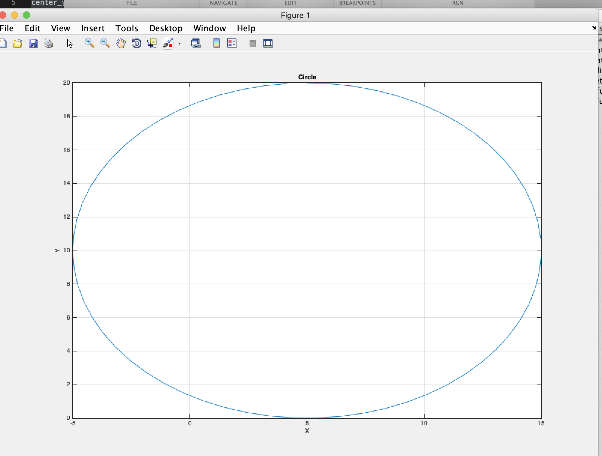
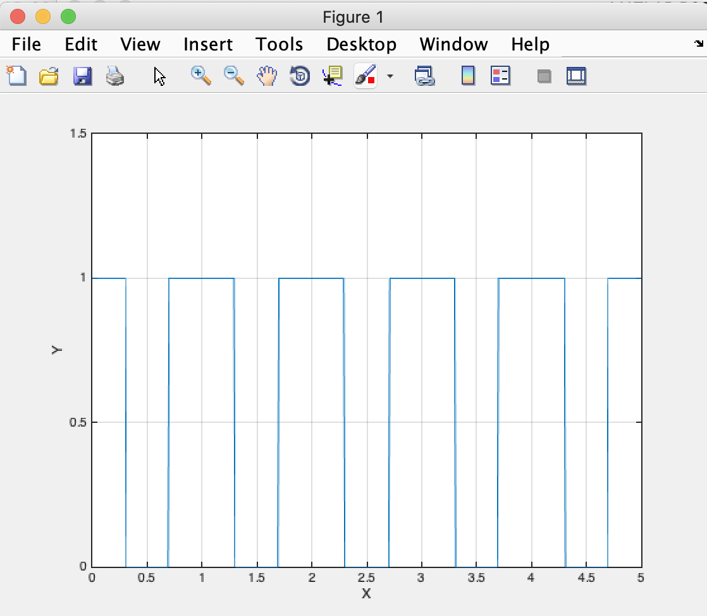

# 그래프 그리기


## plot 을 이용한 2차원 그래프
* 그래프의 구성
    - title
    - x label
        - x 축 이름
    - y label
        - y 축 이름
    - legend
        - 그래프 구분

```matlab
>>> plot(x, y, option);
```

- x 
    - x 축 데이터 벡터
- y
    - y 축 데이터 벡터
    - x 축 데이터 벡터와 크기가 같아야 함
- option
    - 그래프의 형태에 대한 옵션

```matlab
clear ;
clc ;


t = linspace(0, 5, 100);
f = 1;
y = sin( 2*pi*f*t );

figure(1) % 여러 그래프를 따로 띄울때 필요한 인덱싱?

plot(t, y, '-or') ;
```


## 여러 그래프 한 화면에 띄우기

```matlab

clear ;
clc ;

t = linspace(0, 2, 100);

f1 = 1;
f2 = 3;
f3 = 5;

y1 = cos( 2*pi*f1*t );
y2 = cos( 2*pi*f2*t );
y3 = cos( 2*pi*f3*t );
y4 = y1 + y2 + y3 ;

figure(1);

plot(t, y1, '-o', t, y2, '-x', t, y3, '-^', t, y4, '-d');

title('sinusoid');
xlabel('Time, t [sec]');
ylabel('Signal y(t)');
legend('1Hz', '3Hz', '5Hz', 'sum');

```


```matlab

% holdon 이용해서 한 그래프에 계속 추가 하기

figure(1)
plot(t, y1);
hold on;
plot(t, y2);
plot(t, t3);

grid on; % 그래프 위에 안내선 그리기
title('test');
xlabel('foo');
ylabel('bar);

```


## 오늘 한 삽질.

```matlab
clear;
clc;

t = linspace(0, 6, 600);

y1 = exp(-t);
y2 = cos( pi*t )
y3 = y1 .* y2 ; % <- 원소 끼리의 곱하기이기 때문에 .* 을 해줘야 한다.
figure(1);

subplot(311);
plot(t, y1, '-b');
subplot(312);
plot(t, y2, '-b');
subplot(313);
plot(t, y3, '-b');

```

여기서 

` y3 = y1 * y2 ;` 를 했더니 오류가 발생함.

- y1 이라는 요소를 y2 모든 원소에 곱하려고 하는 것이기 때문에 이 때는 ` .* ` 연산자를 이용해야 한다. ` * ` 연산자는 행렬 곱을 의미한다.

* 또 헷갈린 것. a = 1:10 -> 1,2,3,4,5,6,7,8,9,10 의 행렬 
    * a = 1:0.1:10 -> 1에서 10까지 0.1 스텝의 단행열


이번주 과제 결과

1번 문제

```matlab
clc ;
clear ;

center_x = 5
center_y = 10
radius = 10;
thetha = 0:0.1:2*pi;

x_func = radius .* sin(thetha) + center_x ;
y_func = radius .* cos(thetha) + center_y ;

figure(1)
plot(x_func, y_func);
grid on;
xlabel('X');
ylabel('Y');
title('Circle');

% 연습1번 클리어
```



2번문제

```matlab
clear ;
clc;

tau = 1;
width = 0.3;
% 0~0.3 1 
% 0.7 ~1 1
%0.3 ~ 0.7 tau - width 가 기준이네
% 시작부터 0.3 ~ 
y = []
x = 0:0.01:5;
length(x)
for idx = 1: length(x)
    if mod(x(idx), tau) > width % over 0.3
        if mod(x(idx), tau) < tau - width
            y(idx) = 0;
        else
            y(idx) = 1;
        end
    else
        y(idx) = 1;
    end
end

figure(1)
plot(x,y)
grid on;
xlabel('X');
ylabel('Y');
axis([0 2 -0 1.5]);

```




3번 연습 문제

```matlab
clear ;
clc;

tau = 1;
width = 0.3;
% 0~0.3 1 
% 0.7 ~1 1
%0.3 ~ 0.7 tau - width 가 기준이네
% 시작부터 0.3 ~ 
y = []
x = 0:0.01:5;
length(x)
for idx = 1: length(x)
    if mod(x(idx), tau) > width % over 0.3
        if mod(x(idx), tau) < tau - width
            y(idx) = 0;
        else
            y(idx) = 1;
        end
    else
        y(idx) = 1;
    end
end

y_2 = []

for idx = 1: length(x)
    if y(idx) == 0
        y_2(idx) = cos(2*pi*5*x(idx));
    else
        y_2(idx) = cos(2*pi*5*x(idx) + pi);
    end
end

figure(1)
plot(x,y_2)
grid on;
xlabel('X');
ylabel('Y');
axis([0 2 0 1]);

```

