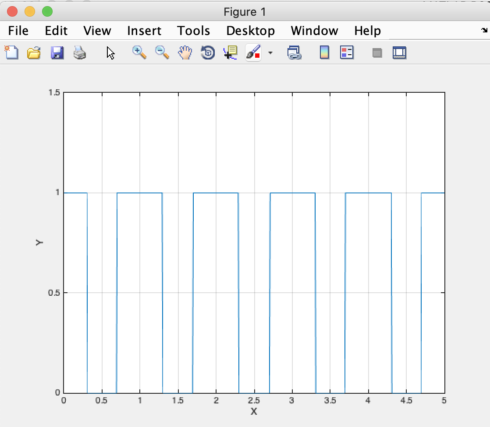
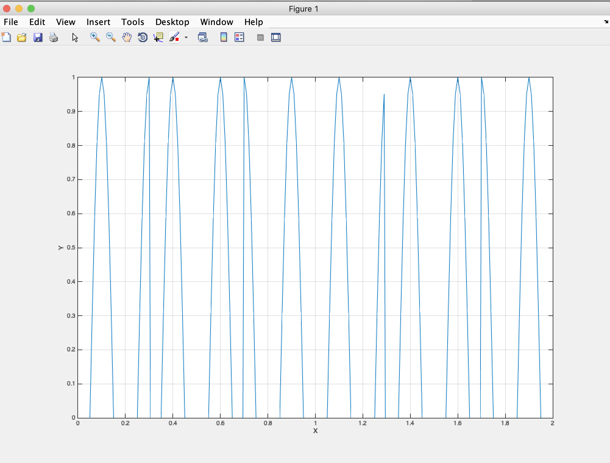

# 임베디드신호처리 과제 리포트

## 2015146007 임베디드 시스템과 김 세 환


##  1번 문제

```matlab
clc ;
clear ;

center_x = 5
center_y = 10
radius = 10;
thetha = 0:0.1:2*pi;

x_func = radius .* sin(thetha) + center_x ;
y_func = radius .* cos(thetha) + center_y ;

figure(1)
plot(x_func, y_func);
grid on;
xlabel('X');
ylabel('Y');
title('Circle');

% 연습1번 클리어
```


* 이 문제를 풀면서 느낀 점
    - 우선 이 코드를 구현 할 때 직교좌표계에 극좌표계를 구현한다는 느낌으로 코드를 작성했다.
    - x^2 + y^2 = 1 이 직교좌표계에서 원을 그리는 방법이다.
    - 이것은 sin^2(x) + cos^2(y) = 1 과 동일하다.
    - x = rsin(thetha) , y = rcos(thetha) 로 표현이 가능하다.

## 2번문제

```matlab
clear ;
clc;

tau = 1;
width = 0.3;
% 0~0.3 1 
% 0.7 ~1 1
%0.3 ~ 0.7 tau - width 가 기준이네
% 시작부터 0.3 ~ 
y = []
x = 0:0.01:5;
length(x)
for idx = 1: length(x)
    if mod(x(idx), tau) > width % over 0.3
        if mod(x(idx), tau) < tau - width
            y(idx) = 0;
        else
            y(idx) = 1;
        end
    else
        y(idx) = 1;
    end
end

figure(1)
plot(x,y)
grid on;
xlabel('X');
ylabel('Y');
axis([0 2 -0 1.5]);

```

* 이 문제를 풀면서 느낀 점
    - 우선 for idx = 1: length(x) 와 같은 루핑 테크닉이 유용하다는걸 느꼈다.




## 3번 연습 문제

```matlab
clear ;
clc;

tau = 1;
width = 0.3;
% 0~0.3 1 
% 0.7 ~1 1
%0.3 ~ 0.7 tau - width 가 기준이네
% 시작부터 0.3 ~ 
y = []
x = 0:0.01:5;
length(x)
for idx = 1: length(x)
    if mod(x(idx), tau) > width % over 0.3
        if mod(x(idx), tau) < tau - width
            y(idx) = 0;
        else
            y(idx) = 1;
        end
    else
        y(idx) = 1;
    end
end

y_2 = []

for idx = 1: length(x)
    if y(idx) == 0
        y_2(idx) = cos(2*pi*5*x(idx));
    else
        y_2(idx) = cos(2*pi*5*x(idx) + pi);
    end
end

figure(1)
plot(x,y_2)
grid on;
xlabel('X');
ylabel('Y');
axis([0 2 0 1]);

```




* 이 문제를 풀면서 느낀 점
    - 위에 작성한 2번 연습문제 코드를 그대로 사용하고, 새로운 변수 어레이에 값을 담을 때
    - 기존 y라는 어레이에 담긴 값(0 혹은 1)을 활용하여 if문과 함께 코드를 작성했다.
    - for 문은 중첩될수록 시간 복잡도가 제곱하여 증가하지만, if문은 전혀 시간 복잡도를 증가시키지 않기 때문에 if문을 최대한 활용하려고 했습니다.


## 감사합니다!