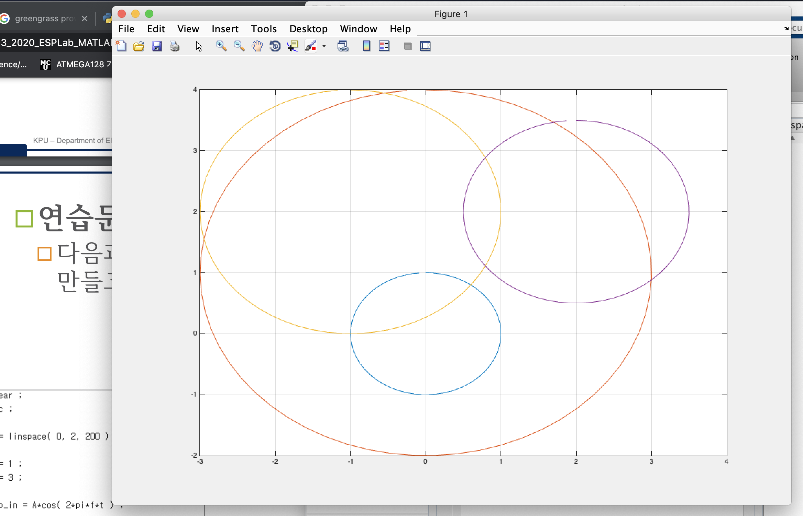
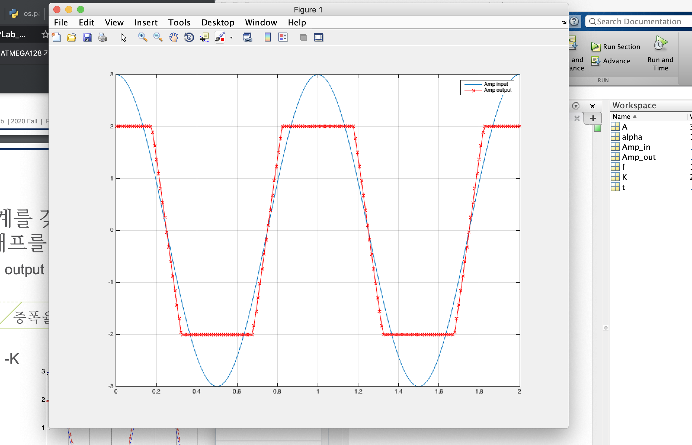

# 임베디드신호처리 과제 리포트

## 2015146007 임베디드 시스템과 김 세 환

### 1번 연습문제

* make_circle.m

```matlab
function [x, y] = make_circle(cx, cy, rad)
    thetha = 0:0.1:2*pi;
    x = rad .* sin(thetha) + cx;
    y = rad .* cos(thetha) +cy;
```

test.m

```matlab
clear;
clc;

[x1, y1] = make_circle(0, 0, 1);
[x2, y2] = make_circle(0, 1, 3);
[x3, y3] = make_circle(-1 , 2, 2);
[x4, y4] = make_circle(2, 2, 1.5);

figure(1)
plot(x1, y1, x2, y2, x3, y3, x4, y4);
grid on;
```





### 2번 문제

* amp_k_alpha.m

```matlab
function[y] = amp_k_alpha(alpha, K, Amp_in)

    y = [];
    for idx = 1:length(Amp_in)
        if (Amp_in(idx) * alpha) < K
            if (Amp_in(idx) * alpha) > -K
                y(idx) = alpha * Amp_in(idx);
            elseif (Amp_in(idx) * alpha) < - K
                y(idx) = - K;
            end
        else
            y(idx) = K;
        end
    end
    
```

* test.m

```matlab
clear;
clc ;
t = linspace(0, 2, 200);

f = 1;
A = 3;

Amp_in = A*cos(2 * pi * f * t);

alpha = 1.5;
K = 2;

Amp_out = amp_k_alpha(alpha, K, Amp_in);

figure(1)
plot(t, Amp_in, t, Amp_out, 'r-x');
grid on;
legend('Amp input', 'Amp output');
```




* 느낀점
    - 저번에 배운 루핑 테크닉 
    ```matlab 
    length(x) 
    for 1:length(x)
    ```
    이 부분을 유용하게 사용했다.