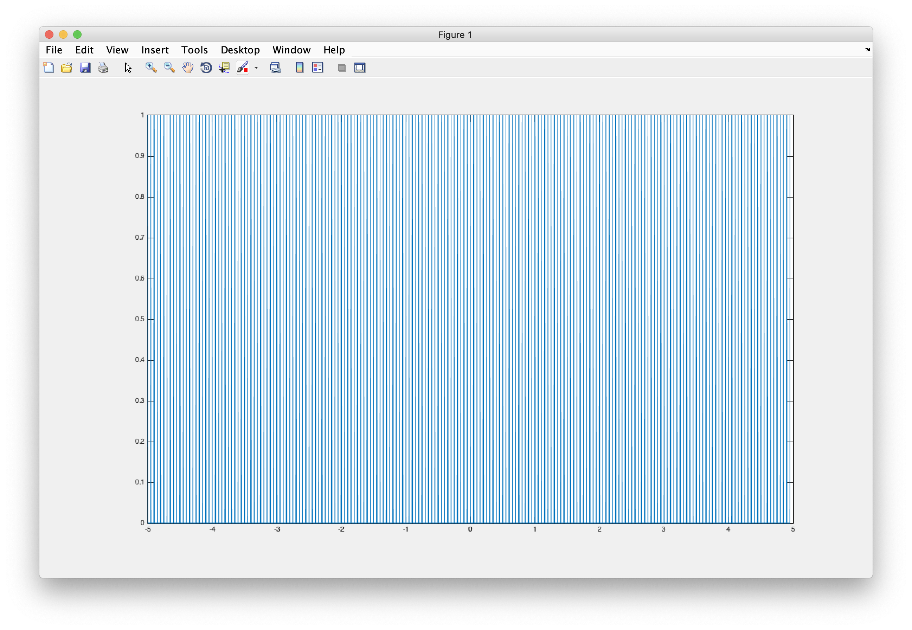
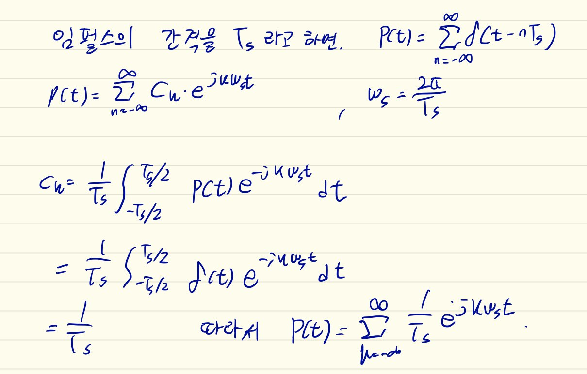
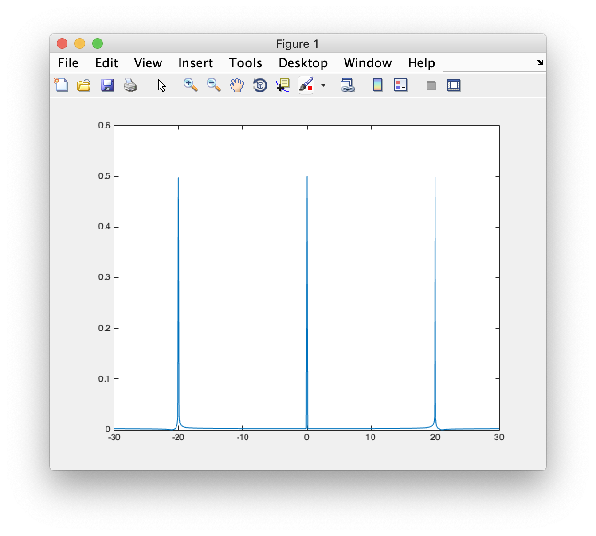
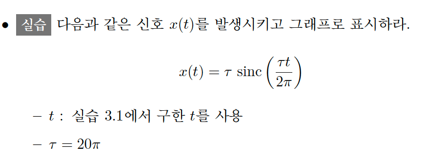
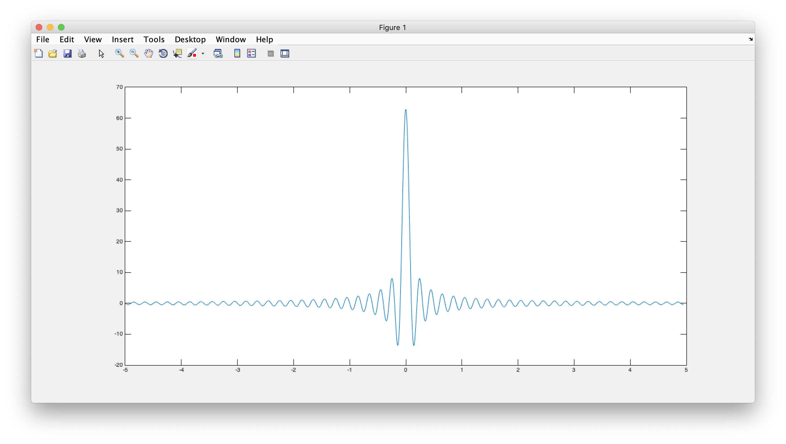
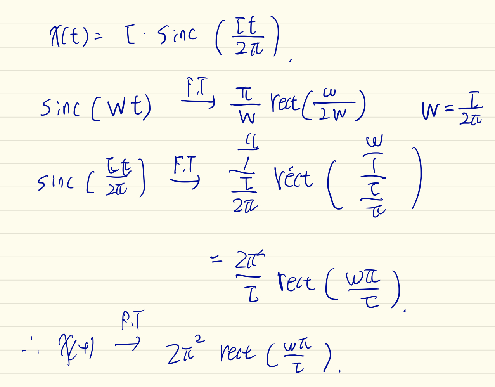
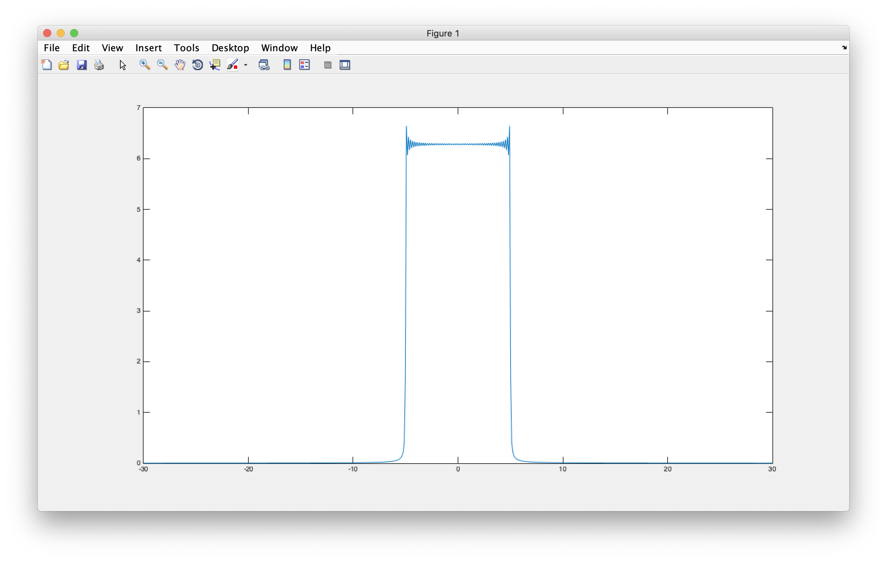

# 결과 보고서 (Sampling)


## 3.1 임펄스열 발생

* `t1 = -5`, `t2 = 5`, `fs = 20Hz`, `N = 4096` 일 때의 임펄스열 그래프.




* 임펄스 발생 코드

```matlab
function [impulse_t, impulse_p] = GenImpulse(t1, t2, f_s, N)
  T_s = 1/f_s

  left_max_pulse = abs(fix(t1/T_s));
  right_max_pulse = (fix(t2/T_s));
  each_zero = 0;
  last_zero = 0;
  result_pulse = [];
  posible_pulse_num = left_max_pulse + right_max_pulse;

zero_pulse_num = N - posible_pulse_num;
each_zero = fix(zero_pulse_num/ (posible_pulse_num - 1));
last_zero = rem(zero_pulse_num, (posible_pulse_num - 1));
if last_zero > each_zero
    N = N - last_zero;
    last_zero = 0; 
end
n_range = T_s/(each_zero + 1);

  
  for i = 1 : posible_pulse_num - 1
    result_pulse = [result_pulse 1];
    for j = 1 : each_zero
      result_pulse = [result_pulse 0];
   
    end
  end
  result_pulse = [result_pulse 1];
  for i = 1 : last_zero
      result_pulse = [result_pulse 0];
  end
  
  pulse_n = t1:n_range:t1 + n_range * (N - 1);
  impulse_t  = pulse_n;
  impulse_p = result_pulse;
  end
```


* 임펄스열 p(t)의 Fourier Transform 을 손으로 계산하라.



* 임펄스열 p(t)의 크기 스펙트럼을 구하여 그래프에 표시하고 손으로 계산한 FT와 비교해라.



- 그래프로 구한 크기 스펙트럼. 20Hz 마다 주파수 성분이 보이는 것을 확일 할 수 있다.

- p(t)를 FT 한 결과와 비교해보면, 20Hz 마다 주파수 성분을 확인 할 수 있다.

## 3.2 sinc 함수 발생



```matalb
x_t = tau * sinc((tau * t)/(2 * pi));
```



* sinc 함수 생성 결과.



- 해당 sinc 함수의 FT 결과.

* 신호 x(t)의 크기 스펙트럼을 matlab을 이용하여 그래프에 표시하고, 손으로 계산한 FT와 비교해라.



* 손으로 구한 FT 결과 값과 비교해보면, sinc함수의 FT는 구형파 형태로 표현된다.
* sinc 함수의 tau 값이 커지면, FT결과의 구형파의 폭은 줄어드는 반비례 관계를 갖고 있다. 


* sinc 함수의 FT
    - 실습 예제에서의 `tau = 20 * pi` 이다.
    - 구형파의 주기는 W 값에 따라서 결정되는데, `W = tau/ 2 * pi` 이므로
    - 실습 예제에서 W = 10Hz 로 나타난다. 
    - 즉 가장 높은 주파수 B = 10Hz 이다.

## 3.3 표본화