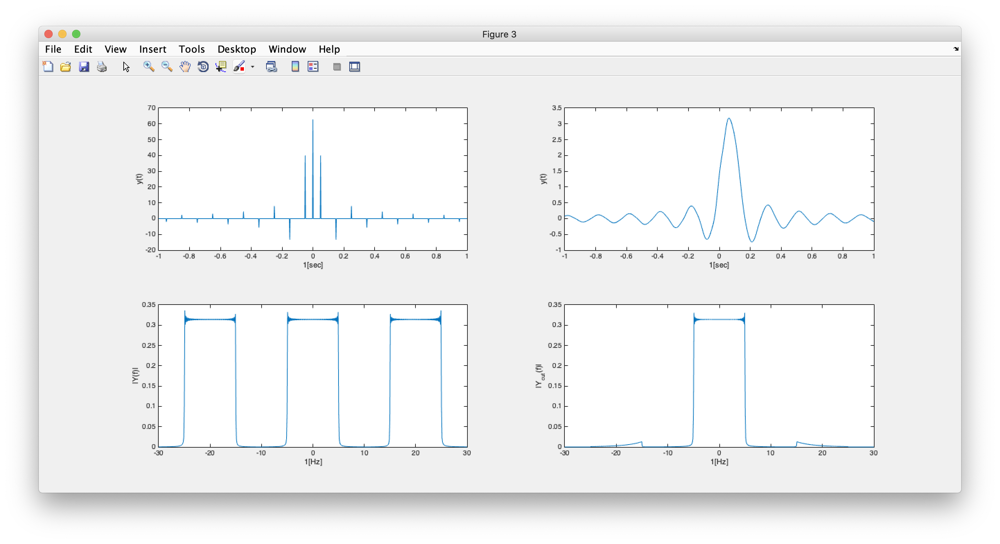

# 결과 보고서 (Sampling)

실습 1조 `오해찬, 김세환`


## 3.1 임펄스열 발생

* `t1 = -5`, `t2 = 5`, `fs = 20Hz`, `N = 4096` 일 때의 임펄스열 그래프.

{: width="75%" height="75%"}


* 임펄스 발생 코드

```matlab
function [impulse_t, impulse_p] = GenImpulse(t1, t2, f_s, N)
  T_s = 1/f_s

  left_max_pulse = abs(fix(t1/T_s));
  right_max_pulse = (fix(t2/T_s));
  each_zero = 0;
  last_zero = 0;
  result_pulse = [];
  posible_pulse_num = left_max_pulse + right_max_pulse;

zero_pulse_num = N - posible_pulse_num;
each_zero = fix(zero_pulse_num/ (posible_pulse_num - 1));
last_zero = rem(zero_pulse_num, (posible_pulse_num - 1));
if last_zero > each_zero
    N = N - last_zero;
    last_zero = 0; 
end
n_range = T_s/(each_zero + 1);

  
  for i = 1 : posible_pulse_num - 1
    result_pulse = [result_pulse 1];
    for j = 1 : each_zero
      result_pulse = [result_pulse 0];
   
    end
  end
  result_pulse = [result_pulse 1];
  for i = 1 : last_zero
      result_pulse = [result_pulse 0];
  end
  
  pulse_n = t1:n_range:t1 + n_range * (N - 1);
  impulse_t  = pulse_n;
  impulse_p = result_pulse;
  end
```


* 임펄스열 p(t)의 Fourier Transform 을 손으로 계산하라.

{: width="75%" height="75%"}

* 임펄스열 p(t)의 크기 스펙트럼을 구하여 그래프에 표시하고 손으로 계산한 FT와 비교해라.

{: width="75%" height="75%"}

- 그래프로 구한 크기 스펙트럼. 20Hz 마다 주파수 성분이 보이는 것을 확일 할 수 있다.

- p(t)를 FT 한 결과와 비교해보면, 20Hz 마다 주파수 성분을 확인 할 수 있다.

## 3.2 sinc 함수 발생

{: width="75%" height="75%"}

```matalb
x_t = tau * sinc((tau * t)/(2 * pi));
```

{: width="75%" height="75%"}

* sinc 함수 생성 결과.

{: width="75%" height="75%"}

- 해당 sinc 함수의 FT 결과.

* 신호 x(t)의 크기 스펙트럼을 matlab을 이용하여 그래프에 표시하고, 손으로 계산한 FT와 비교해라.

{: width="75%" height="75%"}

* 손으로 구한 FT 결과 값과 비교해보면, sinc함수의 FT는 구형파 형태로 표현된다.
* sinc 함수의 tau 값이 커지면, FT결과의 구형파의 폭은 줄어드는 반비례 관계를 갖고 있다. 

{: width="75%" height="75%"}

* sinc 함수의 FT
    - 실습 예제에서의 `tau = 20 * pi` 이다.
    - 구형파의 스펙트럼은 W 값에 따라서 결정되는데, `W = tau/ 2 * pi` 이므로
    - 실습 예제에서 2B = 10Hz 로 나타난다. 
    - 즉 가장 높은 주파수 B = 5Hz 이다.

## 3.3 표본화

- 앞서 발생한 임펄스열을 이용하여 sinc함수를 표본화 하고, 표본화 된 신호를 그래프에 표시해라.

{: width="75%" height="75%"}

- 표본화된 신호 y(t)의 FT를 손으로 계산하라.
{: width="75%" height="75%"}

원신호가 ws 주기로 반복되는 연속, 주기 신호로 나타난다.(실습 예제 10Hz)


- 표본화 된 신호 y(t)의 크기 스펙트럼을 그래프에 표시하고, 이와 같은 스펙트럼이 나오는 이유를 설명하여라.

{: width="75%" height="75%"}

- ws 의 간격 만큼 주기적으로 신호가 반복된다. 위 FT 손으로 계산한 그림에서
- `X(w - kws)` 의 형태로 보이는 부분 때문에 `k = -무한 ~ 무한`의 구간에서 계속해서 신호가 나타나게 된다.
- 즉 샘플링한 신호를 FT하게 되면, 원신호의 스펙트럼이 계속해서 반복되는 형태가 나타난다.


## 3.4 시간영역과 주파수 영역에서의 표본화 비교

- 실습 3.1 ~ 3.3의 그래프를 한 화면에 표시하고 시간 영역과 주파수 영역에서의 표본화 과정을 비교하라.

{: width="75%" height="75%"}


```matlab
clear;
clc;

t1 = -5
t2 = 5
N = 4096
f_s = 20

tau = 20 * pi
[impulse_t, impulse_p] = GenImpulse(t1, t2, f_s, N);
t = impulse_t;
x_t = tau * sinc((tau * t)/(2 * pi));
Samplified_y = prod([x_t; impulse_p]);

%for picuture 7
figure(1)
subplot(3,2,1)
plot(t, impulse_p);
xlim([-1,1]);
subplot(3,2,3)
plot(t, x_t);
xlim([-1,1]);
subplot(3,2,5)
plot(t, Samplified_y);
xlim([-1,1]);
[t_f0 , X] = myfun_SA(t, impulse_p);
[t_f0, X_sinc] = myfun_SA(t, x_t);
[t_f0, X_samp] = myfun_SA(t,Samplified_y);
subplot(3,2,2)
plot(t_f0, abs(X));
xlim([-30,30]);
subplot(3,2,4)
plot(t_f0, abs(X_sinc));
xlim([-30,30]);
subplot(3,2,6)
plot(t_f0, abs(X_samp));
xlim([-30,30]);
```

- 표본화 주파수를 다음과 같이 바꿔가며 3.1 ~ 3.3을 반복하여 Nyquist sampling rate에 대해 설명하라.

`fs = {10Hz, 15Hz}`

{: width="75%" height="75%"}

*fs = 10Hz*

- FT된 sinc함수의 최대 주파수(B)가 5Hz였으므로, 샘플링 할 수 있는 최소 주파수는 10Hz보다 커야한다. 10Hz에서는 알리아싱이 발생한다.

{: width="75%" height="75%"}

- 10Hz 이상으로 샘플링 했기 때문에 알리아싱이 발생하지 않았다.

## LPF를  이용한 복원

```matlab
clear;
clc;

t1 = -5
t2 = 5
N = 4096
f_s = 10

tau = 20 * pi
[impulse_t, impulse_p] = GenImpulse(t1, t2, f_s, N);
t = impulse_t;
x_t = tau * sinc((tau * t)/(2 * pi));
Samplified_y = prod([x_t; impulse_p]);

fc=8;
[z, p, k] = buttap(5)
[num, den] = zp2tf(z,p,k);
[num, den] = lp2lp(num, den, 2*pi*fc);
[num_d, den_d] = bilinear(num, den, 1/abs(t(2)-t(1)));

y_out = filter(num_d, den_d, Samplified_y);


[f0, X0] = myfun_SA(impulse_t, impulse_p);
X0 = abs(X0);
[f1, X1] = myfun_SA(t, Samplified_y);
X1 = abs(X1);
[f2, X2] = myfun_SA(t, y_out);
X2 = abs(X2);

figure (3)  
subplot(2,2,1)
  plot(t, Samplified_y);
  xlabel('1[sec]');
  ylabel('y(t)');
  xlim([-1,1]);
subplot(2,2,3)
  plot(f1, X1);
  xlabel('1[Hz]');
  ylabel('|Y(f)|');
  xlim([-30,30]);
subplot(2,2,2)
  plot(t, y_out);
  xlabel('1[sec]');
  ylabel('y(t)');
  xlim([-1,1]);
subplot(2,2,4)
  plot(f2, X2);
  xlabel('1[Hz]');
  ylabel('|Y_{cut}(f)|');
  xlim([-30,30]);
```

- 그림 10 (표본화 주파수 10, 컷오프 주파수 8 버터워스 필터를 이용한 복원)

{: width="75%" height="75%"}


- 그림 11 (표본화 주파수 15, 컷오프 주파수 8 버터워스 필터를 이용한 복원)

{: width="75%" height="75%"}


- 그림 12 (표본화 주파수 20, 컷오프 주파수 8 버터워스 필터를 이용한 복원)

{: width="75%" height="75%"}
